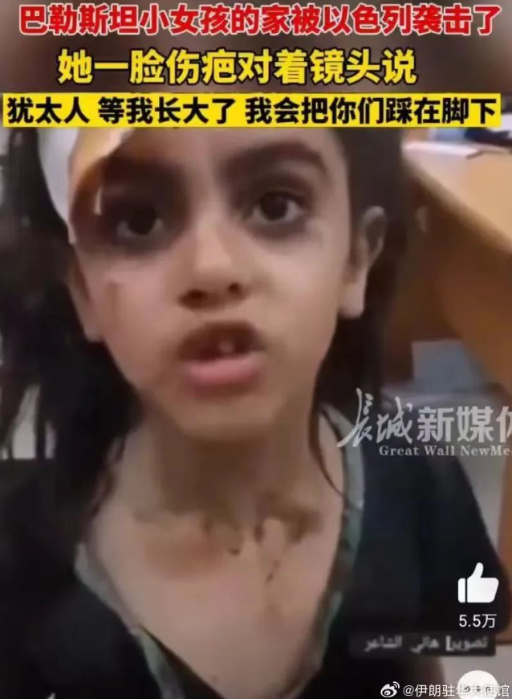
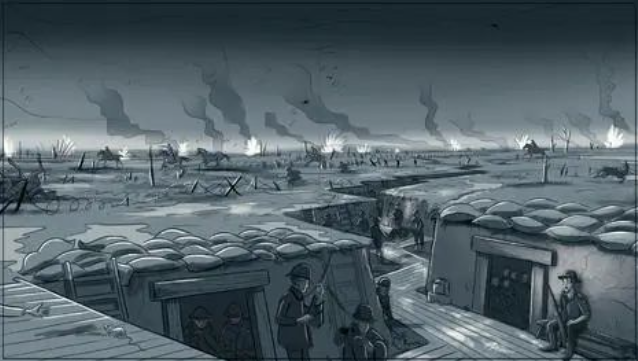
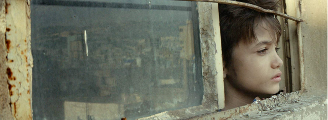

> ### 国庆节刚刚结束，大家还在对或躺平或旅行的假日意犹未尽时，一群参加音乐节的青年遭了难。

当地时间8日，据媒体报道以色列救援服务组织扎卡（Zaka）称，以色列和平音乐节7日遭哈马斯袭击后，现场发现至少260具尸体。报道称，根据社交媒体视频和参加音乐节人的描述，事发地位于在加沙-以色列边境附近，**==`哈马斯枪手向逃跑的人们无差别扫射开枪，并将其他人劫持为人质。`==**

此后，**`中东局势`**突变。到如今，已是**`巴以战争`**的第四天。截至11日，据不完全统计，已有超过两千人在此次战争中丧生，十几万人被迫失去家园流离失所。

人们为什么愤怒，战争为什么会发生？这是很多人在面对战争爆发的最直接疑问。但<u>**吊诡**</u>的是，此后很多人的关注点往往会转移到战况如何，谁能赢。甚至有讨论者更像是进行着一场押注游戏——以立场问题和网友展开争论，只借助残忍的战争讨论着孰是孰非。

但我们不能忘记，摒除“宏大叙事”与“历史纠纷”还有一个视角其实和我们更相关——个体的视角。

 

## 日常变得奢侈，仇恨只能带来仇恨

清晨6:28分，当防空警报再次响起，以色列魏茨曼研究所里的学生们只能快速从五六楼甚至更高的地方跑下楼梯，他们的目的地是最底层的防空洞。楼梯间是开放式的，长长的走廊只有及腰的围墙和铁丝网隔绝外部。每下一层楼，学生们悬着的心只能放下一点点，只有到了最底层的防空洞才能暂时安全。这是北京时间10月7日，正在魏茨曼研究所的B站用户“冥界银行行长”上传的视频。当网友问他如今情况如何时，他只能回答“还活着”。

以色列在遭遇袭击后对哈马斯及加沙地区展开地毯式轰炸。这种不同于过往“敲屋顶”先让在地居民有个准备的轰炸方式，让加沙地区死伤无数。据报道统计加沙地带超4万人的房屋被损坏或摧毁，这其中包括银行、电力、医院，媒体大楼等所有维系人们生活的机构中枢。此外，以色列也宣布全面封锁加沙地区， 包括切断电力供应、阻止水、食物和燃料的供给，已有超18万名巴勒斯坦人逃离家园。

从历史经验来看，双边关系恶化导向的战争，最终只能让极少部分群体或政客完成政治主张。**而更多的结局则是，只留下血仇和民族阴影，进而带来更多血的代价。**

**战争的攻击也是无差别的，任何人在那个当下，动作都可能变形和异化，而被迫受难、却无法表达的永远是和你我一样的个体，此后的他们，无论是重返和平还是深陷战争，都只能被动承受失去亲人、谋生机会、居住地等命运带来的一切失序。**

 

## 战争与动乱之下，别去苛责受害者

值得关注的是，在这样的背景下，依旧有不少舆论会对准那些出现在战争附近或动乱之间的普通人。比如站队某个具体国家的人，会指责另一个族群都有罪，死有余辜，比如针对留学生群体的记录，部分网友会留言质问为何要去以色列留学；抑或是针对国庆期间发生的泰国枪击案，质问受伤之人为何明知东南亚舆论负面还去旅行。

到巴以冲突开始后，部分网民也把矛头对准了选择前往以色列度过国庆的旅行者。

当争论只留在论点本身，生命的消逝好像变成了理所当然、轻如鸿毛的事。这是反常的，也是**==`人性的淡漠`==**。

对某种行为的不理解通常来自于双方的认知偏差，这中间牵涉到不同人接触的信息、信息源的不同。也有双方从小到大教育背景、社交圈、经济基础等各类差异。但无论如何，罪恶往往归因于群体暴举，而不是不该出现在某处的具体个体。

> ***个体不该以退一步让出自由空间的方式来换取安全，这本身就是不合理的。指责受害者固然容易，因为受害者都是单一个体，也都是弱势，但我们每个人都有可能成为受害者，如果指责不针对暴举，而只找弱者身上的问题，这样做无益于环境的改善。毕竟在动乱与战争发生之前，没有人能预知会发生什么，你的相安无事，未必是因为你的决策正确，也可能只是你比较幸运而已。***

当战争与动乱爆发之后，**==`人性的恶`==**也爆发到最顶点，它不会因为你没做什么而转移对你的伤害。

那么，如何去消除认知偏差，去了解自己未曾了解的世界便是一种解决方案。建立同理心看起来是一种付出，但当群体都拥有更多同理心，实际上也是在帮助包括我们在内的每一个个体让所生存的环境更好。

在战争下，个体究竟在经历着什么？流离失所、缺衣少食是常态，但他们具体经历着什么？《安妮日记》或许能给我们一些答案。

 

## 重读《安妮日记》，理解战争下的个体

“犹太人必须佩戴一颗黄色六角星……犹太人只准在下午三点到五点之间买东西……犹太人晚上八点以后禁止坐在自己或朋友的花园里……犹太人不许坐汽车，开私人的汽车也不行……”

1940年5月后，伴随着荷兰投降纳粹德国，犹太人在荷兰的处境日益恶劣，生存环境也越缩越小。安妮作为随着父亲从德国来荷兰暂避的犹太人也这样经历着种种不公平。她的朋友、同为犹太人的贾奎琳只能无奈地表示：**“我已经什么也不敢做了，我怕那是不准做的。”**

但那时候的安妮仍旧可以和朋友们每周去室内的乒乓球桌上打球，再去只供犹太人消费的小食店吃一次可口的冰淇淋，这也是她回忆起来很快乐的时光。但这远还不是结束，最终，针对犹太人的无差别大屠杀终于展开。而13岁的安妮也在1942年随着家庭藏匿在父亲曾经工作过的公司的秘密屋中。当生存空间极剧压缩，甚至走动与说话时间都被限制，她只能通过日记抒发心中的困苦与成长的烦恼。

在秘密屋这个小小的空间里，住着安妮、姐姐、父母还有范丹夫妇和他们的儿子。此后，又住进来一个牙医。他们的生活靠此前父亲的朋友救济。在秘密屋生活的两年间，屋子里8人的心态随着战争的起起落落而漂浮，安妮也在这个地方“具体”地成长着。

她会期盼救济的朋友米普每周末送来的五本书。她直言“正常人体会不到书对一个被禁闭的人意味着什么。读书、学习、听收音机，就是我们仅有的消遣。”

她也在这样的**<u>逼仄</u>**环境中萌芽了自己的爱情，这是对她们的邻居家男孩彼特。但她有大量的时间可以沉思和反省，她也得出更升华的结论：“我无法想象必须像母亲、范丹太太和所有其他的女人那样生活，她们尽了本分，后来被世人遗忘。除了丈夫和孩子，我还要有我能为之献身的目标！”

即便生存危机一直伴随着她，即便她也经常在面临战争没完没了的绝望局面质问自己活着到底有什么意义。但她仍旧希望活下去，“在我死后也继续活下去”。

她其实早已是一个难民，这种“罪恶”仅来自于她的血统（如果罪恶成立的话），但她仍旧是一个有血有肉、会观察思考的成长中的作家。

当然，现实总是残酷的，1944年，安妮一家因被告密而被盖世太保找到，随后她被转运去集中营，同年病死在了里面。一个曾经和你我一样的生命便是因为战争这样逝去了。

**在这样的大时代下，有的时候受害者，活着本身沦为了一种受罪的过程。**

电影《何以为家》中，也记录着黎巴嫩难民的生活。经历中东的各类战局，赞恩一家成为难民，但父母仍旧在无节制地生孩子。当他们的女儿来例假之后，她们又把孩子卖掉来换钱。法庭上，十二岁的长子赞恩向法官状告他的亲生父母，原因是，他们给了他生命，但只是虐待、折磨他。因为身份非法，他也无法上学就医……这就是战争之下，所有人不得不面对的失序生活。

## 拥有同理心，理解人道主义在和平年代仍有意义

在《安妮日记》中，米普也是一个重要角色。安妮一家藏匿后，是她一次又一次前来送各类物品，保障了后屋中所有人的日常所需。而在那个年代，做这样的事也要面临很大的生存威胁，但在全球，仍旧有不少具有人道主义精神的普通人及团体，在黑暗中帮助着受难者逃出生天、存活下去。

小说《数星星》就记录着丹麦的普通家庭安妮一家帮助犹太人邻居逃脱的故事。真正的勇气并不是无畏，而是在畏惧中仍旧选择坚定内心。在那样的时代背景下，**<u>做为战败国的丹麦，其国民有偿或无偿帮助境内超过90%的犹太人活了下来。</u>**这也是同理心与人道主义带来的力量——它可以让受害者看到生的希望，得到救助。而在这样的环境中，即便现实仍旧是恐怖的，但每个人对于周遭的安全感会增加、温情会增加，因为会更相信善良的存在。

战争年代对于我们来说，似乎已经很远了。很多时候我们也只在远处传来战争的消息时才有这样广泛的关注。又或者出现在争论场景下，成为某些网民厌恶他国人时过嘴瘾的谈资。但这些都是战争对于我们的影响，**==`以暴制暴只会带来更多的仇恨，也从来不是解决问题的根本方式。`==**在和平年代，讨论战争与人道主义依旧有着深刻的现实意义，它也能帮助我们建立更好的未来社会。